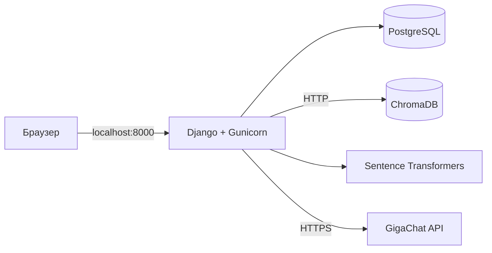

# RAG System

Учебное Django-приложение для поиска ответов по учебным материалам. Преподаватель
загружает PDF и DOCX, приложение создаёт векторный индекс, а студент задаёт
вопросы и получает ответы от GigaChat с указанием источников.

Проект развивается как DevOps pet project. Текущая конфигурация предназначена
для локального запуска и ещё не является production-ready.

## Архитектура



Все компоненты запускаются через Docker Compose. PostgreSQL хранит данные
приложения, а ChromaDB — векторный индекс документов.

**Стек:** Python 3.12, Django 6, Gunicorn, PostgreSQL 15, ChromaDB,
sentence-transformers, GigaChat API, Docker Compose.

## Запуск

Для запуска нужны Docker, Docker Compose и credentials для GigaChat API.
Устанавливать Python на хост не требуется.

1. Создайте файл окружения:

   ```bash
   cp .env.example .env
   ```

2. Заполните в `.env` обязательные секреты:

   - `DJANGO_SECRET_KEY`;
   - `GIGACHAT_CREDENTIALS`;
   - `POSTGRES_PASSWORD`.

3. Проверьте конфигурацию и запустите контейнеры:

   ```bash
   docker compose config --quiet
   docker compose up -d --build --wait
   ```

4. Создайте таблицы Django:

   ```bash
   docker compose exec django_app python manage.py migrate
   ```

5. При необходимости создайте администратора:

   ```bash
   docker compose exec django_app python manage.py createsuperuser
   ```

После первого входа в админку создайте институт и курс — они необходимы для
регистрации студентов и создания предметов.

## Адреса

| Назначение | URL |
|---|---|
| Вход | <http://localhost:8000/login/> |
| Регистрация студента | <http://localhost:8000/register/student/> |
| Django Admin | <http://localhost:8000/admin/> |
| Health endpoint | <http://localhost:8000/health/> |

## Полезные команды

```bash
# Состояние контейнеров
docker compose ps

# Логи Django
docker compose logs --follow --tail=100 django_app

# Пересборка Django после изменения кода
docker compose up -d --build django_app

# Остановка проекта
docker compose down
```

Данные PostgreSQL и ChromaDB сохраняются в `./volumes/postgres/` и
`./volumes/chroma/`. Это bind mounts, поэтому `docker compose down -v` не удаляет
их с хоста.

## Roadmap

- постоянное хранение media-файлов;
- Nginx, static-файлы и HTTPS;
- развёртывание на сервере;
- CI/CD и версионированные Docker-образы;
- мониторинг, алерты и централизованные логи;
- резервное копирование и проверка восстановления PostgreSQL;
- managed PostgreSQL и S3-совместимое хранилище media.

