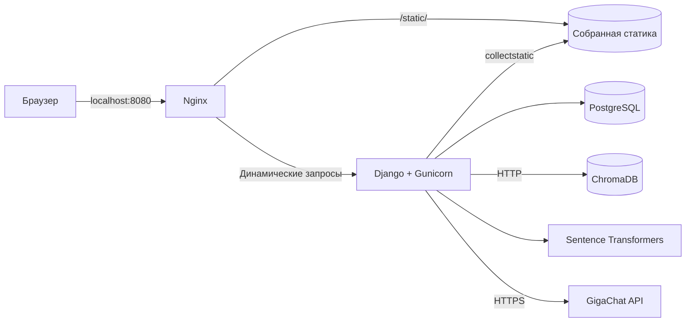

# RAG System

Учебное Django-приложение для поиска ответов по загруженным материалам.
Преподаватель добавляет PDF и DOCX, приложение индексирует текст в ChromaDB,
а студент задаёт вопросы и получает ответы от GigaChat с указанием источников.

Проект развивается как DevOps pet project. Текущая конфигурация предназначена
для локального запуска и ещё не является production-ready.

## Архитектура



Все компоненты запускаются через Docker Compose. PostgreSQL хранит данные
приложения, а ChromaDB — векторный индекс документов.

**Стек:** Python 3.12, Django 6, Gunicorn, Nginx, PostgreSQL 15, ChromaDB,
Sentence Transformers, GigaChat API, Docker Compose.

### Роль Nginx

Nginx является внешней точкой входа на порту `8080`. Запросы к `/static/` он
обслуживает напрямую из общей директории со статикой, а остальные запросы
проксирует в контейнер `django` на внутренний порт `8000`. Gunicorn запускает
Django-приложение и не занимается раздачей статических файлов.

Порт Django `8000` пока также опубликован наружу для локальной диагностики. В
production-подобной конфигурации единой внешней точкой входа должен стать Nginx.

## Запуск

Для запуска нужны Docker, Docker Compose и credentials для GigaChat API.
Устанавливать Python на хост не требуется.

1. Создайте файл окружения:

   ```bash
   cp .env.example .env
   ```

2. Заполните в `.env` обязательные секреты:

   - `DJANGO_SECRET_KEY`;
   - `GIGACHAT_CREDENTIALS`;
   - `POSTGRES_PASSWORD`.

3. Проверьте конфигурацию и запустите контейнеры:

   ```bash
   docker compose config --quiet
   docker compose up -d --build --wait
   ```

4. Примените миграции:

   ```bash
   docker compose exec django python manage.py migrate
   ```

5. Соберите статические файлы Django для Nginx:

   ```bash
   docker compose exec django python manage.py collectstatic --noinput
   ```

6. При необходимости создайте администратора:

   ```bash
   docker compose exec django python manage.py createsuperuser
   ```

После первого входа в админку создайте институт и курс — они необходимы для
регистрации студентов и создания предметов.

## Адреса

| Назначение | URL |
|---|---|
| Вход | <http://localhost:8080/login/> |
| Регистрация студента | <http://localhost:8080/register/student/> |
| Django Admin | <http://localhost:8080/admin/> |
| Проверка Django | <http://localhost:8080/health/> |

## Полезные команды

```bash
# Состояние контейнеров
docker compose ps

# Логи Django и Nginx
docker compose logs --follow --tail=100 django nginx

# Проверка конфигурации Nginx
docker compose exec nginx nginx -t

# Пересборка Django и повторный запуск Nginx
docker compose up -d --build --force-recreate django nginx

# Повторный сбор статики после её изменения
docker compose exec django python manage.py collectstatic --noinput

# Остановка проекта
docker compose down
```

PostgreSQL и ChromaDB сохраняют данные в bind mounts `./volumes/postgres/` и
`./volumes/chroma/`. Поэтому `docker compose down -v` не удаляет эти данные с
хоста.

`./data/static/` содержит результат `collectstatic`. Это генерируемые файлы: их
не нужно коммитить, при необходимости они собираются заново. Media-файлы пока
не подключены к постоянному хранилищу и могут потеряться при пересоздании
контейнера Django.

## Roadmap

- HTTPS и production-настройки Nginx;
- автоматизация миграций и `collectstatic` при развёртывании;
- постоянное S3-совместимое хранилище media-файлов;
- сравнение bind mounts и Docker named volumes;
- CI/CD и версионированные Docker-образы;
- мониторинг, алерты и централизованные логи;
- резервное копирование PostgreSQL и проверка восстановления.
